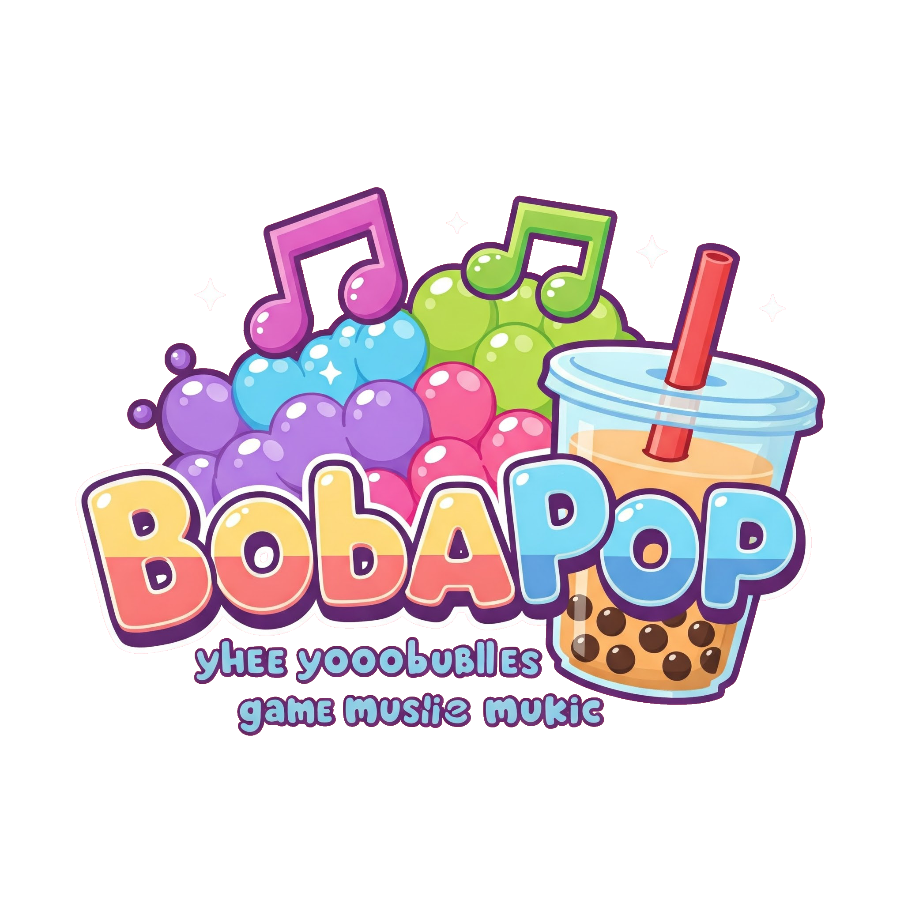
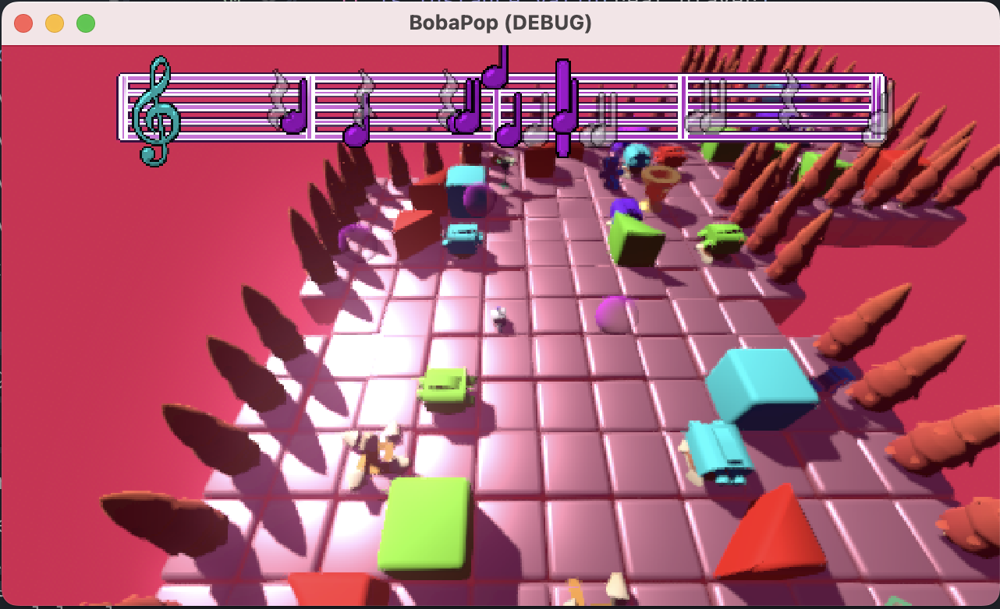
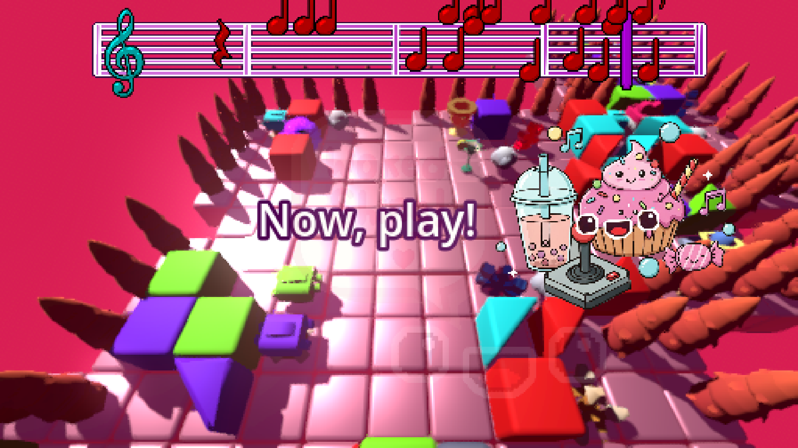
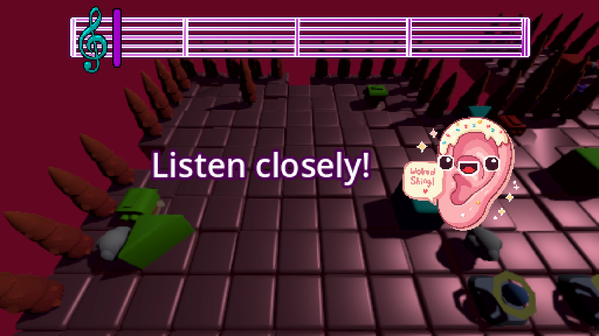
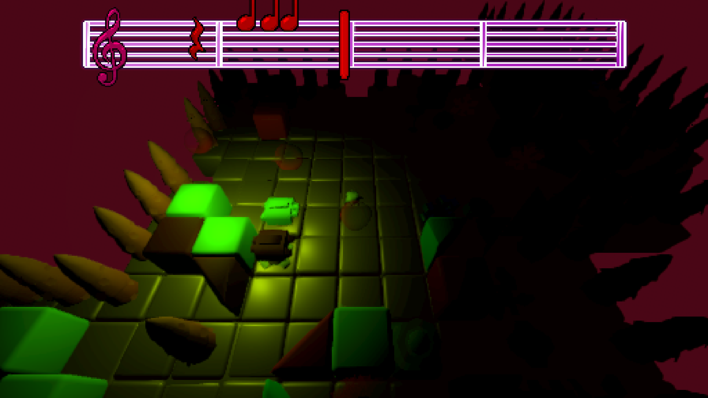
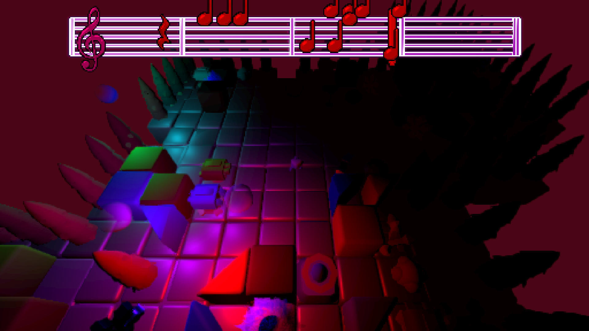
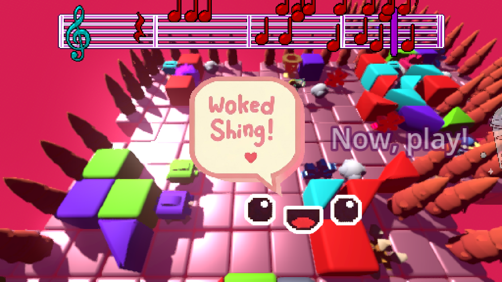

Play at: <https://dmnk.co/bobapop/BobaPop.html>

【ｓｗｅｅｔｉｓｈ　ｂｕｂｂｌｏ　ｆｌｏｗ　Ｂｏｂｂａ　Ｐｏｐｐｅｒｋｉｎ！】

yhee yooobublles?
𝐬𝐨𝐟𝐭𝐥𝐲 𝐬𝐨𝐧𝐠𝐢𝐞𝐬 𝐬𝐢𝐧𝐠 𝐬𝐦𝐚𝐥𝐥𝐢𝐬𝐡 𝐭𝐮𝐧𝐞𝐥𝐞𝐭𝐬. 𝐠𝐥𝐞𝐚𝐦𝐲 𝐧𝐨𝐭𝐞𝐬 𝐠𝐥𝐞𝐚𝐦 𝐜𝐚𝐧𝐝𝐲 𝐬𝐩𝐫𝐚𝐤𝐥𝐞𝐬. 𝐡𝐚𝐩𝐩𝐲 𝐡𝐚𝐧𝐝𝐬 𝐦𝐚𝐤𝐞 𝐟𝐥𝐨𝐰 𝐦𝐮𝐬𝐢𝐜 𝐟𝐮𝐧𝐧𝐢𝐞𝐬.
𝐢𝐬 𝐥𝐢𝐠𝐡𝐭 𝐭𝐨𝐮𝐜𝐡 𝐛𝐮𝐛𝐛𝐥𝐞 𝐰𝐢𝐦𝐬𝐲? 𝐜𝐮𝐭𝐞𝐲 𝐜𝐚𝐧𝐝𝐲 𝐠𝐚𝐦𝐞 𝐲𝐨𝐮 𝐛𝐮𝐛𝐛𝐥𝐞 𝐥𝐢𝐭𝐭𝐥𝐞𝐫 𝐤𝐢𝐧𝐬. 𝐩𝐥𝐚𝐲𝐟𝐮𝐥 𝐟𝐮𝐧𝐧𝐲 𝐟𝐮𝐧𝐬.
𝐝𝐨𝐞𝐬 𝐠𝐥𝐞𝐚𝐦𝐲 𝐟𝐥𝐨𝐰 𝐡𝐚𝐯𝐞 𝐩𝐮𝐫𝐞 𝐣𝐨𝐲𝐢𝐬𝐡 𝐧𝐨𝐰𝐬?

【ｗｏｋｅｄ　ｓｈｉｎｇ．】

=================================
/>

### Screenshot

### Things

Thank you to the authors of gdsion for their software synth and support, and to kennynl for free assets

### License

MIT License

Copyright (c) 2025 ｗｏｋｅｄ　ｓｈｉｎｇ inc．

Permission is hereby granted, free of charge, to any person obtaining a copy of this software and associated documentation files (the "Software"), to deal in the Software without restriction, including without limitation the rights to use, copy, modify, merge, publish, distribute, sublicense, and/or sell copies of the Software, and to permit persons to whom the Software is furnished to do so, subject to the following conditions:

The above copyright notice and this permission notice shall be included in all copies or substantial portions of the Software.

THE SOFTWARE IS PROVIDED "AS IS", WITHOUT WARRANTY OF ANY KIND, EXPRESS OR IMPLIED, INCLUDING BUT NOT LIMITED TO THE WARRANTIES OF MERCHANTABILITY, FITNESS FOR A PARTICULAR PURPOSE AND NONINFRINGEMENT. IN NO EVENT SHALL THE AUTHORS OR COPYRIGHT HOLDERS BE LIABLE FOR ANY CLAIM, DAMAGES OR OTHER LIABILITY, WHETHER IN AN ACTION OF CONTRACT, TORT OR OTHERWISE, ARISING FROM, OUT OF OR IN CONNECTION WITH THE SOFTWARE OR THE USE OR OTHER DEALINGS IN THE SOFTWARE.

Assets included in this package (2D sprites, 3D models and sound effects) are [CC0 licensed](https://creativecommons.org/publicdomain/zero/1.0/)
